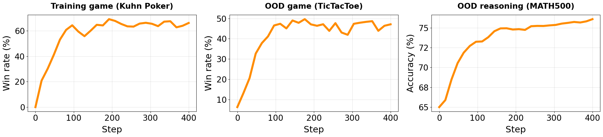

<p align="center"></p>

<h1 align="center"> Self-Play on Zero-Sum Games Incentivizes Reasoning via Multi-Agent Multi-Turn Reinforcement Learning </h1>

<div align="center" style="line-height: 1;">
  <a href="https://arxiv.org/abs/2506.24119" target="_blank">
    
  </a>
  <a href="https://github.com/spiral-rl/spiral" target="_blank"></a>
  <a href="https://huggingface.co/spiral-rl" target="_blank"></a>
</div>

<p align="center">
  <a href="https://huggingface.co/papers/2506.24119"><b>🤗 Hugging Face Paper</b></a> |
  <a href="https://huggingface.co/collections/spiral-rl/spiral-68627f14c250c3cc1fdbf6fe"><b>🤗 Hugging Face Collection</b></a>
</p>

## Updates

* 30/06/2025: 🎉 We release our paper, models, game-play dataset and self-play codebase.

## Introduction
Recent advances in reinforcement learning have shown that language models can develop sophisticated reasoning through training on tasks with verifiable rewards, but these approaches depend on expert-curated problem-answer pairs and domain-specific reward engineering.

We introduce SPIRAL, a self-play framework where models learn
by playing **multi-turn, zero-sum games against continuously improving versions of themselves**, eliminating the need for human supervision. Through zero-sum self-play, SPIRAL generates an **_infinite curriculum_** of progressively challenging problems as models must constantly adapt to stronger opponents.

<p align="center"></p>

Applying SPIRAL to Qwen3 base models in two-player zero-sum text games, we observe the agents develop advanced reasoning strategies to win the competitive game. Furthermore, the trained models show substantial gains on a range of math and general reasoning benchmarks.
These results suggest that self-play in zero-sum games can naturally induce transferable reasoning capabilities, highlighting a promising direction for autonomous reasoning development.

<p align="center"></p>

## Architecture

<p align="center"></p>

SPIRAL employs an actor-learner architecture for scalable self-play training. Parallel actors sample trajectories from a diverse set of games using vectorized environments. A single policy $\pi_t$ plays both roles, generating zero-sum, sparse reward game trajectories. The centralized learner processes these trajectories using Role-conditioned Advantage Estimation (RAE) to compute separate advantages, $A_0(s,a)$ and $A_1(s,a)$, for each role. These are then used for on-policy reinforcement learning updates.

## Usage

### Installation
```bash
# clone codebase
git clone git@github.com:spiral-rl/spiral.git && cd spiral

# prepare environment
conda create -y -n spiral python=3.10
conda activate spiral

# install dependencies
pip install vllm==0.8.4 && pip install oat-llm==0.2.1
pip install -e .
```

### Training

```bash
bash run.sh
```
This training script runs SPIRAL on the Kuhn Poker environment for 400 policy iteration steps. It has been tested on an 8×H100 GPU setup. During training, we evaluate model performance online using three metrics:

1) Win rate against a fixed opponent on the training game;

2) Win rate against a fixed opponent on an out-of-domain game ;

3) Accuracy on math reasoning benchmarks.

Example result curves are shown below.

<p align="center"></p>

### Evaluation

In addition to the online evaluation, we provide offline evaluation across a broader range of benchmarks to assess the model's OOD game and general reasoning capabilities.

**Game evaluation**
```
# we rely on openrouter to play against gemini models
export OPENROUTER_API_KEY=""

# Add your models to the batch_run.sh
bash evals/game/batch_run.sh
```

**Benchmark evaluation**
```
cd evals/benchmarks
# Add your models to the batch_run.sh
bash batch_run.sh
```

## Citation

If you find our work useful for your research, please consider citing:
```bibtex
@article{liu2025spiral,
  title={SPIRAL: Self-Play on Zero-Sum Games Incentivizes Reasoning via Multi-Agent Multi-Turn Reinforcement Learning},
  author={Liu, Bo and Guertler, Leon and Yu, Simon and Liu, Zichen and Qi, Penghui and Balcells, Daniel and Liu, Mickel and Tan, Cheston and Shi, Weiyan and Lin, Min and Lee, Wee Sun and Jaques, Natasha},
  journal={arXiv preprint arXiv:2506.24119},
  year={2025},
  url={https://arxiv.org/abs/2506.24119}
}
```

## Acknowledgement
* This work is supported by [PlasticLabs](https://plasticlabs.ai/) and [Sea AI Lab](https://sail.sea.com/) for computing resources.
* The language games are sampled from [TextArena](https://github.com/LeonGuertler/TextArena), a collection of competitive text-based games for language model evaluation and reinforcement learning.
* The multi-agent, multi-turn RL training is implemented with 🌾 [Oat](https://github.com/sail-sg/oat), a modular and research-friendly LLM RL framework.
* We did exploration on PEFT experiments using [UnstableBaselines](https://github.com/LeonGuertler/UnstableBaselines), a lightweight, LoRA-first library for fast prototyping of self-play algorithms on TextArena.
* The base models are from [Qwen3](https://huggingface.co/Qwen/Qwen3-4B).
