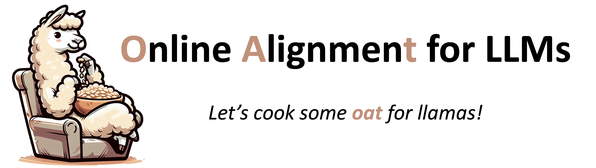

<p align="center">
  
</p>

[](https://pypi.org/project/oat-llm)
[](https://pypi.org/project/oat-llm)
[](https://github.com/sail-sg/oat/blob/main/LICENSE)
[](https://arxiv.org/abs/2411.01493)

[Installation](#installation) | [Usage](#usage) | [Examples](./examples/) | [Citation](#citation)

---

## Updates
* 21/03/2025: We incorporate [Dr. GRPO](https://github.com/sail-sg/understand-r1-zero), which fixes the optimization bias in GRPO.
* 26/01/2025: We support reinforcement learning with verifiable rewards (RLVR) for math reasoning.
* 20/10/2024: We open source Oat, an online LLM alignment framework developed during a research project on online LLM exploration ([sample-efficient alignment](https://arxiv.org/pdf/2411.01493)).
## Introduction

Oat 🌾 is a simple yet efficient framework for running **online** LLM alignment algorithms. Its key features include:

* **High Efficiency**: Oat implements a distributed *Actor-Learner-Oracle* architecture, with each component being optimized using state-of-the-art tools:
  * `Actor`: Utilizes [vLLM](https://github.com/vllm-project/vllm) for accelerated online response sampling.
  * `Learner`: Leverages [DeepSpeed](https://github.com/microsoft/DeepSpeed) ZeRO strategies to enhance memory efficiency.
  * `Oracle`: Model-based oracle by [Mosec](https://github.com/mosecorg/mosec) as a remote service, supporting dynamic batching, data parallelism and pipeline parallelism.
* **Simplified Workflow**: Oat simplifies the experimental pipeline of LLM alignment. With an `Oracle` served online, we can flexibly query it for preference data labeling as well as anytime model evaluation. All you need is to launch experiments and monitor real-time learning curves (e.g., win rate) on wandb (see [reproduced results](https://wandb.ai/lkevinzc/oat-llm)) — no need for manual training, checkpointing and loading for evaluation.
* **Oracle Simulation**: Oat provides a diverse set of oracles to simulate preference/reward/verification feedback.
  * Verifiable rewards supported using rule-based functions.
  * Lightweight reward models run within the actor's process, enabling quick testing on as few as two GPUs.
  * Larger and more capable reward models can be served remotely, harnessing additional compute and memory resources.
  * LLM-as-a-judge is supported via querying OpenAI API for model-based pairwise ranking.
* **Ease of Use**: Oat's modular structure allows researchers to easily inherit and modify existing classes, enabling rapid prototyping and experimentation with new algorithms.
* **Cutting-Edge Algorithms**: Oat implements state-of-the-art online algorithms, fostering innovation and fair benchmarking.
  * PPO/Dr.GRPO (online RL) for math reasoning.
  * Online DPO/SimPO/IPO for online preference learning.
  * Online exploration (active alignment) algorithms, including [SEA](https://arxiv.org/abs/2411.01493), APL and XPO.

## Installation
In a python environment with supported versions (we recommend `3.10`), you could install oat via PyPI:
```shell
pip install vllm==0.8.4 && pip install -U oat-llm
```
Or you could also install in "editable" mode for local development:
```shell
git clone git@github.com:sail-sg/oat.git
cd oat
pip install vllm==0.8.4 && pip install -e .
```

##  Usage

* R1-Zero-like training using Dr. GRPO for math reasoning: [a single-file self-contained implementation](./oat/experiment/run_math_rl.py) with [training script](./examples/math_rl.sh).

* Multi-turn SFT: [an example training script](./examples/multi_turn_sft.sh).

* Online preference learning with active exploration: [a detailed guide](./docs/alignment_as_cdb.md).

## Adopters
Research projects that are built (or integrated) with Oat 🌾:
* [Understanding R1-Zero-Like Training: A Critical Perspective](https://github.com/sail-sg/understand-r1-zero)
* [VeriFree: Reinforcing General Reasoning without Verifiers](https://github.com/sail-sg/VeriFree)
* [SPIRAL: Self-Play on Zero-Sum Games Incentivizes Reasoning via Multi-Agent Multi-Turn Reinforcement Learning](https://github.com/spiral-rl/spiral)
* [GEM: A Gym for Agentic LLMs](https://github.com/axon-rl/gem)

<!-- ## Benchmarking
The benchmarking compares oat with the online DPO implementation from [huggingface/trl](https://huggingface.co/docs/trl/main/en/online_dpo_trainer). Below, we outline the configurations used for oat and present the benchmarking results. Notably, oat 🌾 achieves up to **2.5x** computational efficiency compared to trl 🤗.

<p align="center">
  
</p>

<p align="center">
  
</p>

Please refer to [Appendix C of our paper](https://arxiv.org/pdf/2411.01493#page=17.64) for a detailed discussion of the benchmarking methods and results. -->

## Citation
If you find this codebase useful for your research, please consider citing:

- LLM online alignment framework:
  ```bibtex
  @misc{liu2024oat,
    title={OAT: A research-friendly framework for LLM online alignment},
    author={Liu, Zichen and Chen, Changyu and Wan, Xinyi and Du, Chao and Lee, Wee Sun and Lin, Min},
    year={2024}
    howpublished={\url{https://github.com/sail-sg/oat}},
  }
  ```

- Online exploration method:
  ```bibtex
  @article{liu2024sea,
    title={Sample-Efficient Alignment for LLMs},
    author={Liu, Zichen and Chen, Changyu and Du, Chao and Lee, Wee Sun and Lin, Min},
    journal={arXiv preprint arXiv:2411.01493},
    year={2024}
  }
  ```

## License

`oat` is distributed under the terms of the [Apache2](https://www.apache.org/licenses/LICENSE-2.0) license.

## Acknowledgement
We thank the following awesome projects that have contributed to the development of oat:
* [vLLM](https://github.com/vllm-project/vllm)
* [DeepSpeed](https://github.com/microsoft/DeepSpeed)
* [Mosec](https://github.com/mosecorg/mosec)
* [launchpad](https://github.com/google-deepmind/launchpad)
* [OpenRLHF](https://github.com/OpenRLHF/OpenRLHF)

## Disclaimer

This is not an official Sea Limited or Garena Online Private Limited product.
