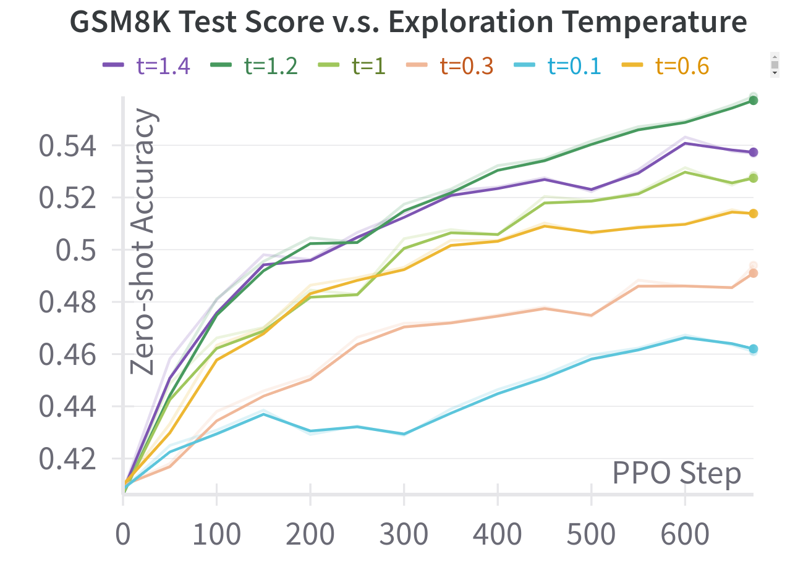
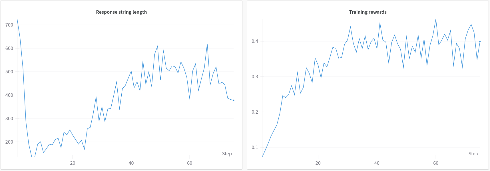

We can easily extend oat 🌾 by running RL with rule-based rewards (result verification) to improve language model's reasoning capability. Below we show an example to run PPO on GSM8K, which improves the test score significantly **from 40.6% to 55.7% with pure RL**!

```
python -m oat.experiment.run_ppo \
    --gpus 8 \
    --collocate \
    --gradient-checkpointing \
    --flash-attn \
    --bf16 \
    --rnd-seed \
    --learning_rate 0.000001 \
    --critic_learning_rate 0.000001 \
    --lr_scheduler polynomial \
    --kl_penalty_coef 0 \
    --num_ppo_epochs 2 \
    --beta 0.0001 \
    --non_stop_penalty 0 \
    --oracle_type reward \
    --oracle gsm8k \
    --pretrain lkevinzc/rho-1b-sft-GSM8K \
    --apply-chat-template \
    --zero-stage 2 \
    --prompt_data lkevinzc/gsm8k \
    --max-train 9999999 \
    --num_prompt_epoch 6 \
    --prompt_max_length 1000 \
    --sync_params_every 1 \
    --num_samples 8 \
    --max_step_adjustment 16 \
    --critic_max_step_adjustment 16 \
    --temperature 1.2 \
    --top_p 0.9 \
    --generate_max_length 1024 \
    --save_steps -1 \
    --input_key question \
    --output_key final_answer \
    --train_split train \
    --train_batch_size 64 \
    --train_batch_size_per_device 8 \
    --rollout_batch_size 64 \
    --rollout_batch_size_per_device 8 \
    --pi_buffer_maxlen_per_device 64 \
    --max_eval 1500 \
    --eval_batch_size 200 \
    --eval_generate_max_length 1024 \
    --eval_steps 50 \
    --eval_temperature 0.35 \
    --eval_top_p 0.9 \
    --eval_n 16 \
    --eval_input_key question \
    --eval_output_key final_answer \
    --use-wb \
    --wb-run-name rho-1b-ppo-gsm8k
```
The experiment finishes in about 6 hours with 8 A100 GPUs.

With this, we ablated how *Boltzmann exploration* (controlled by the sampling temperature) affects the learning efficiency:

<p align="center">
  
</p>

We look forward future studies on other efficient exploration strategies to enhance LLM reasoning.

### DeepSeek R1-zero-like training
Inspired by TinyZero, we also tested R1-zero-like training using GRPO (a variant of PPO that uses trajectory-level Monte-Carlo estimate of advantage) on the CountDown task. An example question of this task is shown as follows:
```
User: Using the numbers [79, 17, 60], create an equation that equals 36. You can use basic arithmetic operations (+, -, *, \/) and each number can only be used once.
```
We use the following command to RL-tune a `Qwen/Qwen2.5-3B` base model and observe R1-zero-like training curves within 3 hours training on 8 GPUs.

```
python examples/r1_zero_countdown.py \
    --critic_type grpo \
    --gpus 8 \
    --vllm_gpu_ratio 0.7 \
    --gradient-checkpointing \
    --flash-attn \
    --bf16 \
    --rnd-seed \
    --learning_rate 0.000001 \
    --lr_warmup_ratio 0.0000001 \
    --kl_penalty_coef 0 \
    --num_ppo_epochs 1 \
    --beta 0.001 \
    --non_stop_penalty 0 \
    --oracle_type reward \
    --oracle countdown \
    --pretrain Qwen/Qwen2.5-3B \
    --zero-stage 2 \
    --ref_offload \
    --prompt_data lkevinzc/CountDownZero \
    --train_split train \
    --input_key input \
    --output_key gt_answer \
    --max-train 9999999 \
    --num_prompt_epoch 1 \
    --prompt_max_length 256 \
    --sync_params_every 1 \
    --num_samples 8 \
    --max_step_adjustment 8 \
    --critic_max_step_adjustment 8 \
    --temperature 1.0 \
    --top_p 0.9 \
    --generate_max_length 1024 \
    --save_steps -1 \
    --train_batch_size 128 \
    --train_batch_size_per_device 2 \
    --rollout_batch_size 128 \
    --rollout_batch_size_per_device 32 \
    --pi_buffer_maxlen_per_device 256 \
    --eval_batch_size 200 \
    --eval_steps 8 \
    --eval_temperature 0 \
    --eval_generate_max_length 1024 \
    --eval_split test \
    --use-wb \
    --wb-run-name qwen-2.5-3b-countdown-grpo 
```

<p align="center">
  
</p>

To achieve this, we only need to add a reward oracle for the specific `CountDown` task (see [here](../oat/oracles/countdown.py); similar to adding a new environment in traditional RL), and oat 🌾 readily takes care of the rest of the job, demonstrating its great extendability.
